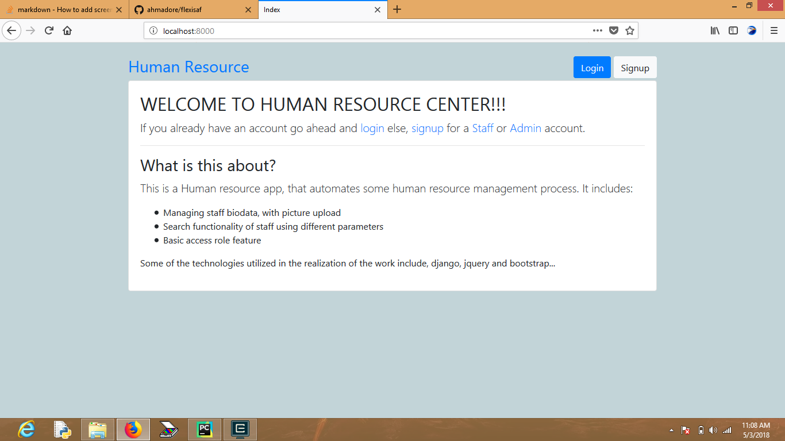
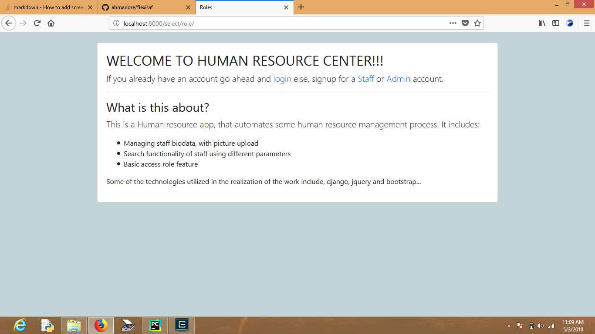
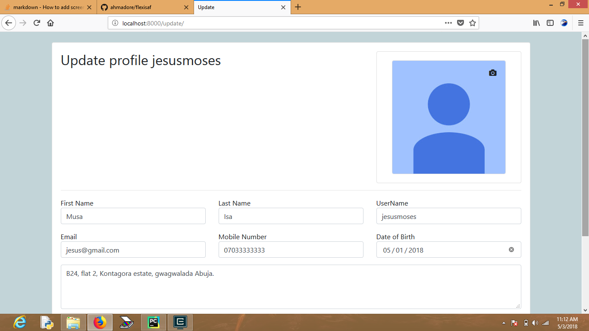
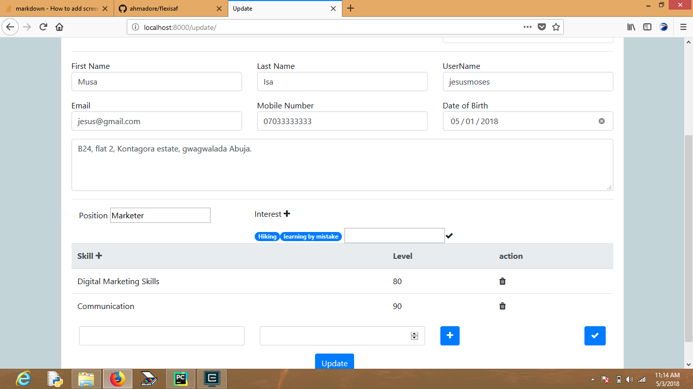
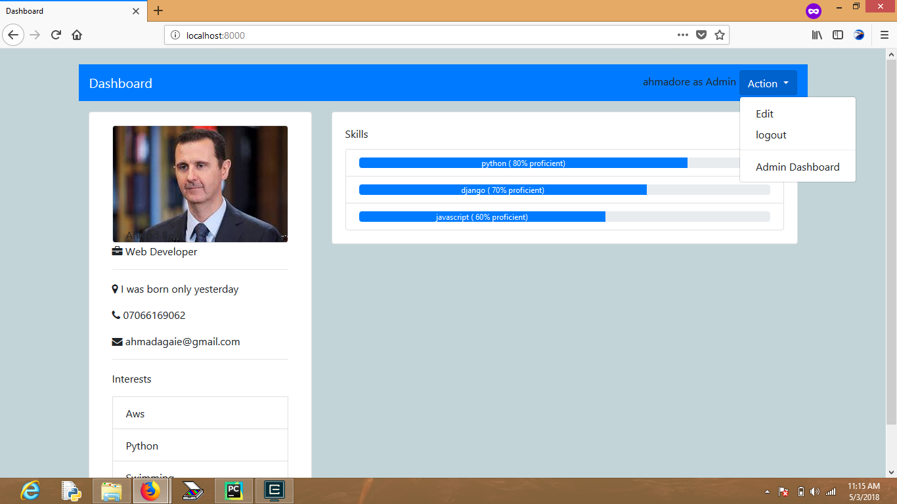
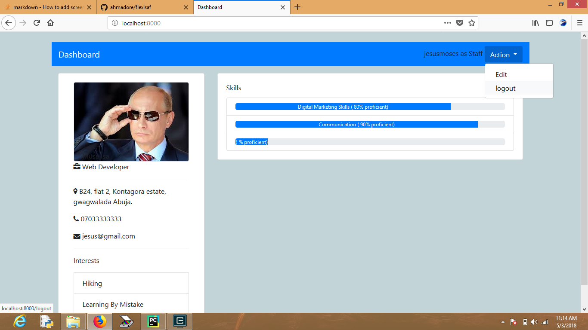
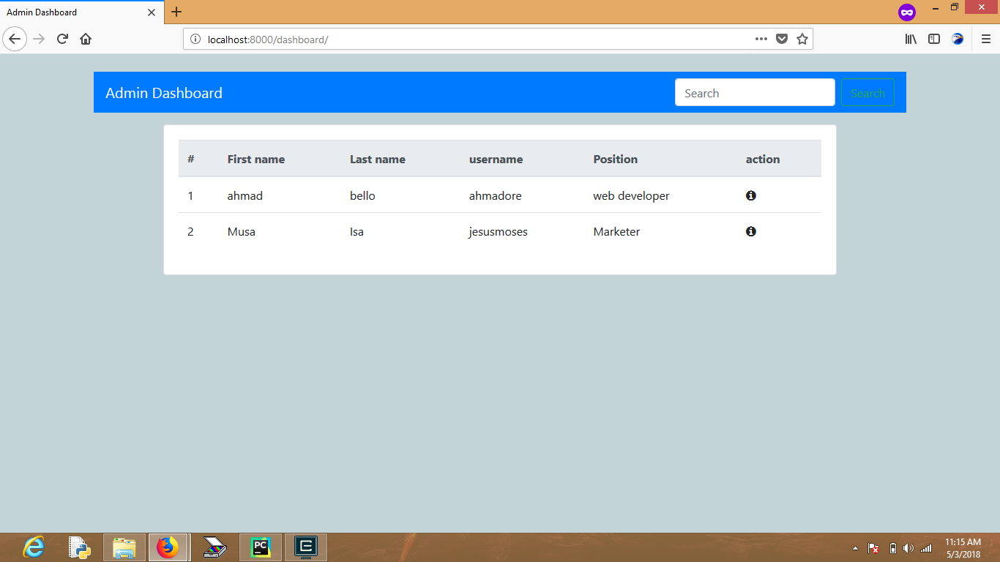

# FLEXISAF TECHNICAL ASSESSMENT

## Human Resource management app ##
features include:-
1) User accounts
2) Dashboard
3) Access Role

## How to deploy
1) git clone https://github.com/ahmadore/flexisaf

2) install python 3 and pip install -r requirements.txt

3) start mysql server

run commands

4) python manage.py createdb

5) python manage.py makemigrations

6) python manage.py migrate

### start server with

7) python manage.py runserver --port

    ### optional for windows users
    a) double click on setup file  
    b) to start server, double click on startserver file  
    c) go to browser and enter the url "localhost:8000"  

### go to localhost:port/

## Work Flow
1) Go to the index page
   

     
   

2) signup as admin or staff
   

     
   

3) update profile
   

     
   

   a. upload picture  
    b. add skills  
    c. add interests  
    
    

     
    

    d. add position e.g Web  developer, accountant etc  
    e. click on update button when you are done

4) redirected to the dashboard

5) the difference between the staff and admin dashboard, is the administration option as shown below

  

  

6) Admin dashboard with user list and search functionality

  

## ERD/Class Diagram for the User model.

The django.db.auth.models.AbstractUser was subclassed. This is to facilitate for easy extension of the model when business requirements change in the
future.

AbstractUser(Superclass)
------------------------------
-id  
-first_name  
-last_name  
-username  
-password  
-email  

User(Subclass).
---------------
-is_admin  
-picture  
-position  
-skills  
-interest  
-address  
-date_of_birth  
-mobile_number  

## Notes

1) Account signup forms has AdminSignUpForm and SignUpForm(Staff), the major difference is that, the AdminSignForm overrides the SignUpForm's
    save method to set the is_admin flag to True.

2) A more secure approach should be utilized in practice to create different user types in the system, such as giving the superuser the ability to
    approve admin signup request.

3) JsonField is used to emulate NoSql behavior, as interests and skills will vary for the different employees in the system, using a relational
    model will be counter intuitive as a table called Skill or Interest will require its table to exhaustively list all the possible skills employees can have,
    and most of the columns will be empty, i.e the table will be sparsely populated. This criteria has fulfilled the need for embedded type data model.

4) AbstactUser works like the django.contrib.auth.models.User model, except that it has to be subclassed to be used.
    Using the in-built User models has the advantage of factory authentication system for login, logout, authenticate etc
